<h4 align="center"> 
	🚧 Cardápio 🚀
</h4>

  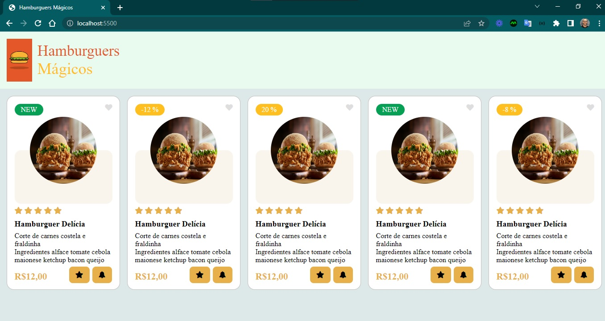

  

Um cardápio de um restaurante e ser possível acessar esse cardápio por um qr code.

- [ ] desenvolver o cardápio conforme o design - frontend
- [ ] estilizar design dinamicamente
- [ ] design responsivo: desktop, tablet, mobile
- [ ] desenvolver o qr code 
- [ ] criar as informações a partir do json - backend

### QR Code

- [gerador de qr code](https://app.qr-code-generator.com/getstarted)
- o link do qr code: https://qrco.de/bdQMqr
- a imagem do qr code

  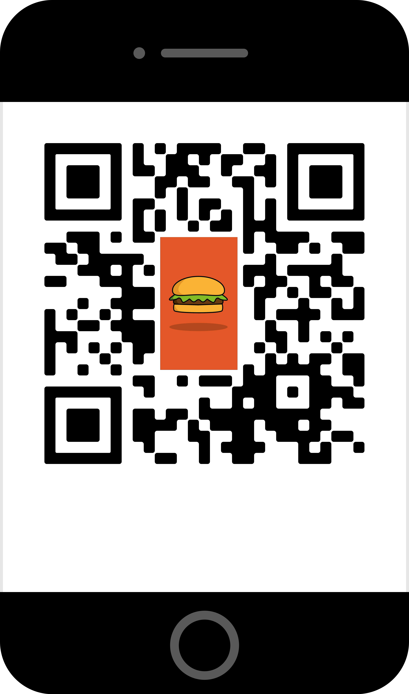

#### Inspirações

  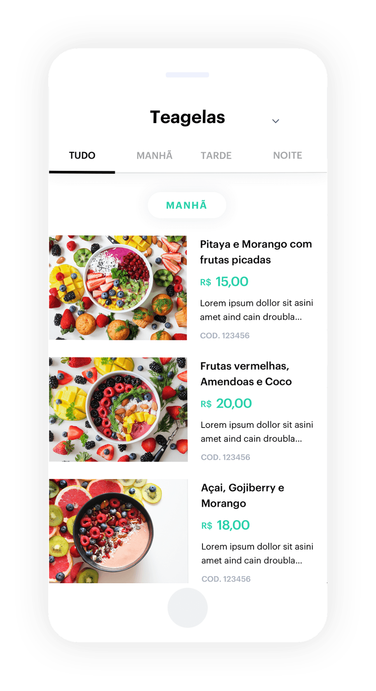
  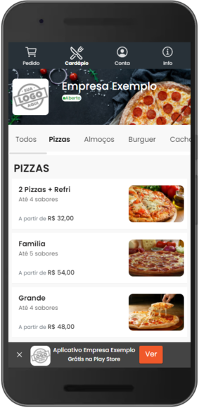
  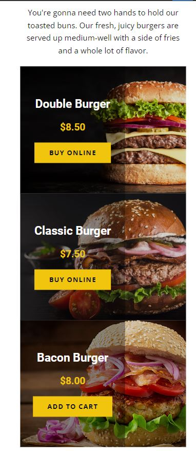
  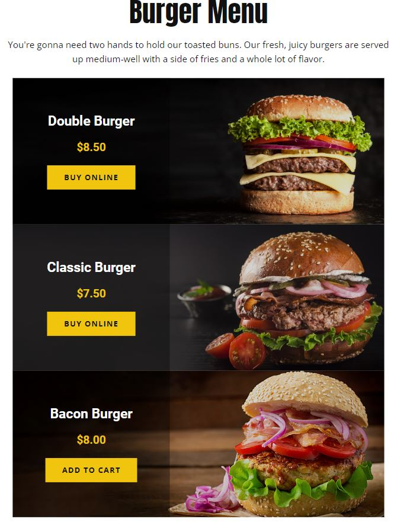
  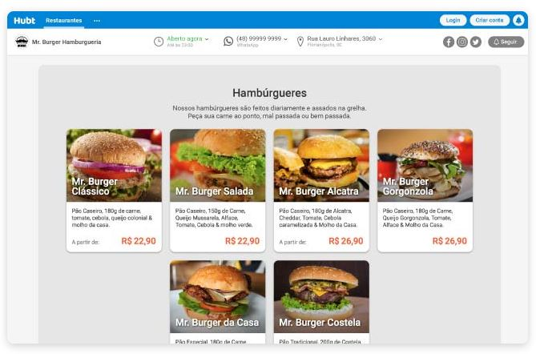
  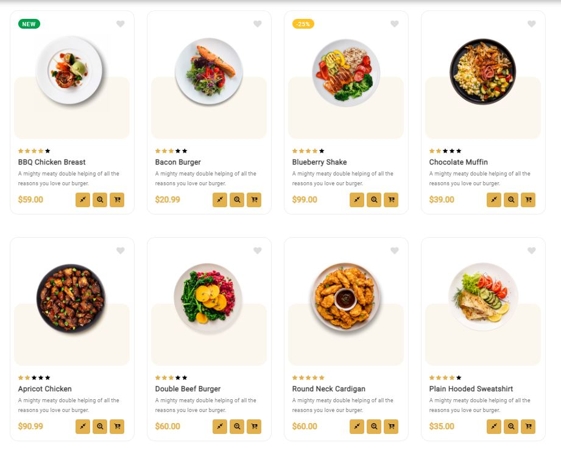
  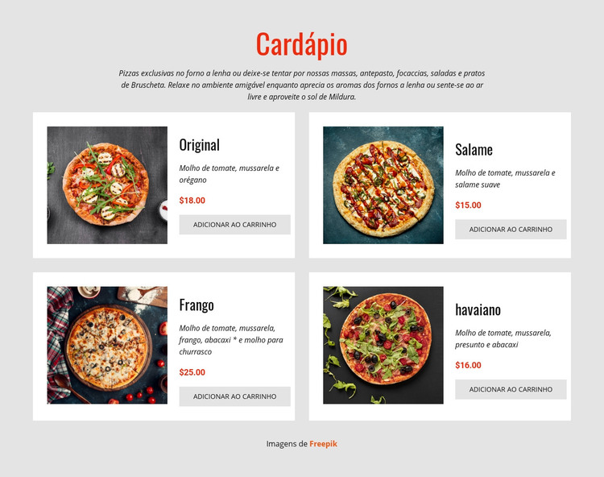

#### Design

- cores
- fontes
- imagens

#### Versões

- desktop

  
  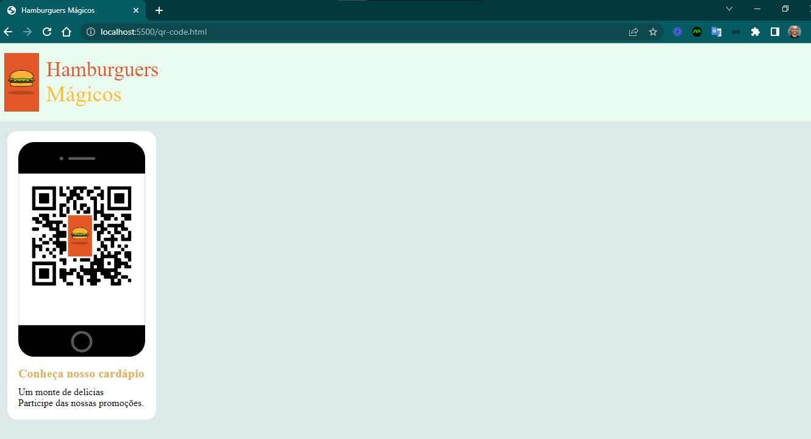

  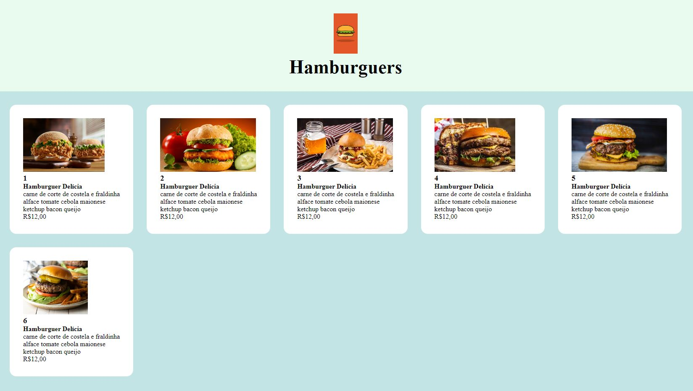
  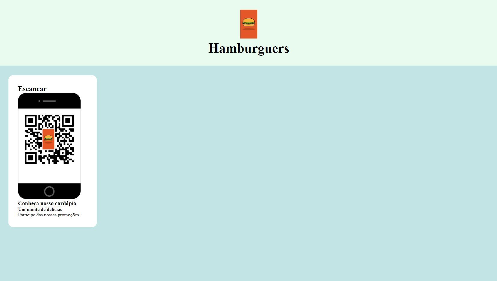

- mobile

  
  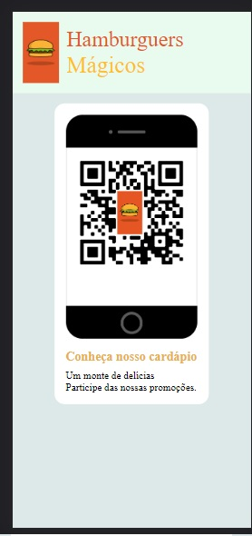

  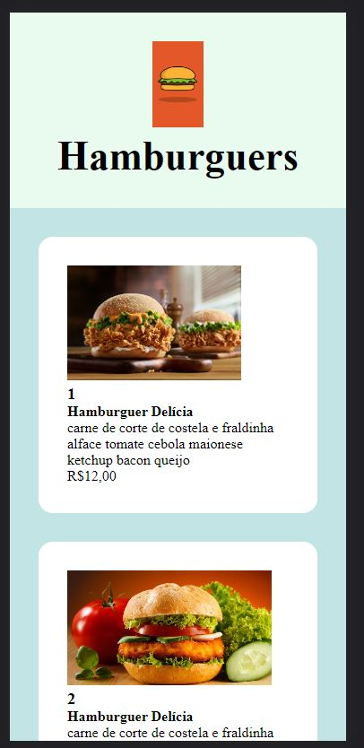
  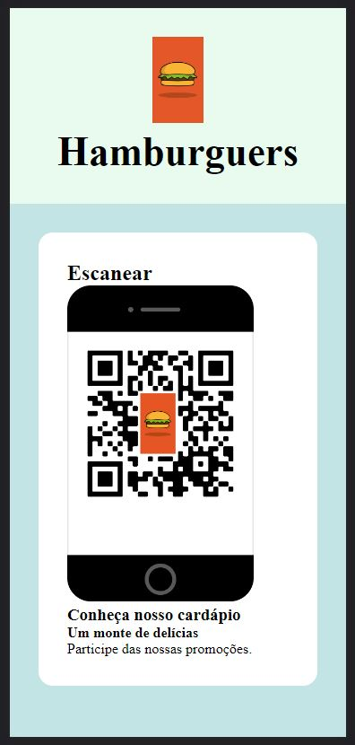

#### Novos Clientes e produtos digitais

Criar a identidade visual de negócios locais, com o processo de cs desenhado e atendido digitalmente.
Fazer para os seguintes estabelecimentos e hospedar: imagem, PDF, site.

. cardápio 
.. de bolos
.. de bebidas
.. de lanches
.. de porções 
.. de cafés 

. catálogo 
.. fisioterapeuta 
.. contador
.. advogado 
.. dentista 
.. médico 

. serviços 
.. mecânico 
.. manicure 
.. cabelereiro 
.. marceneiro 
.. engenheiro civil 

. locais 
.. padaria
.. farmácia 
.. loja de roupa feminina 
.. loja de roupa masculina 
.. confecção de roupa sjn